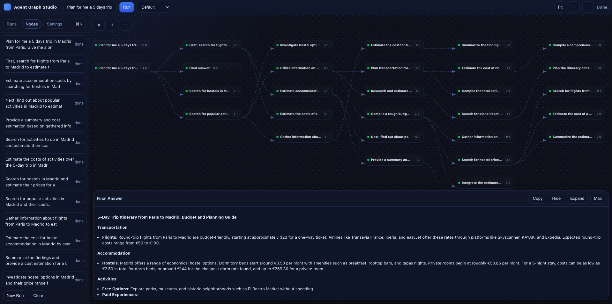
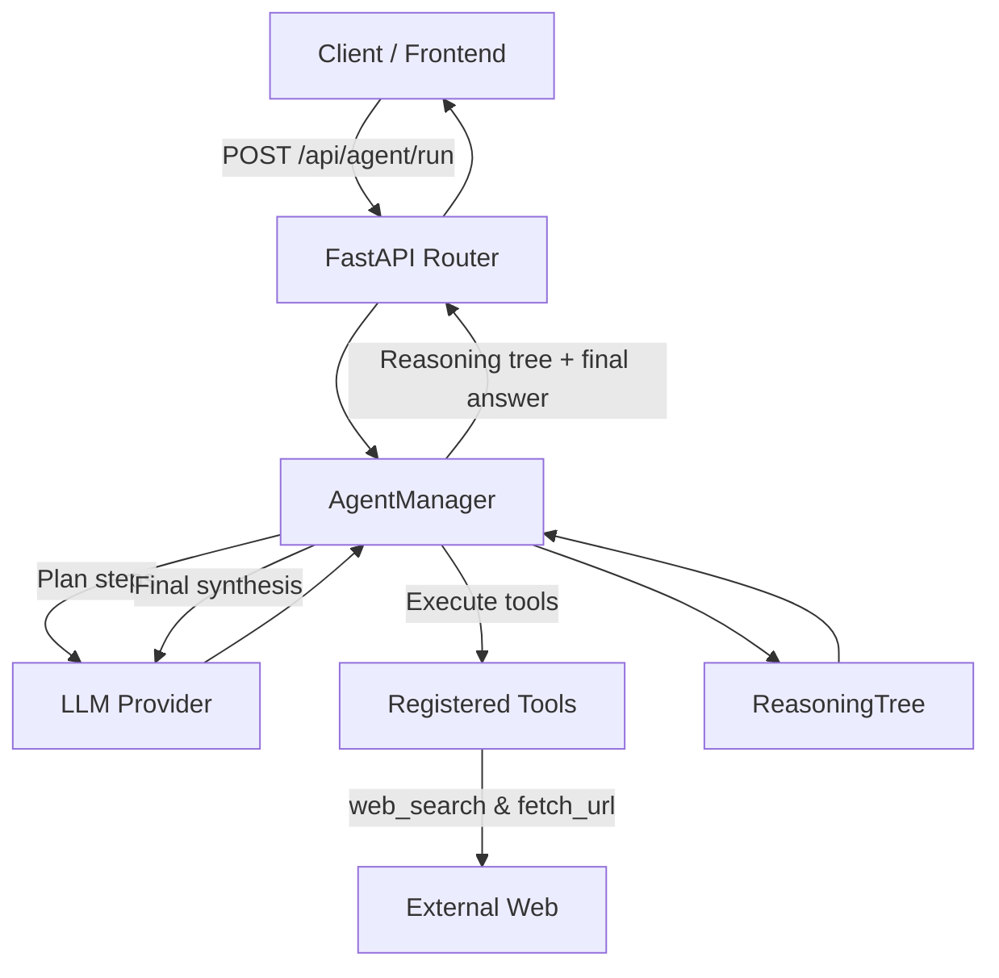

# TreeThinkerAgent

TreeThinkerAgent is a lightweight orchestration layer that turns any LLM into an autonomous multi-step reasoning agent. It supports multi-step planning, tool execution, and final synthesis while exposing the entire reasoning process as a tree you can explore.

This project is lightweight and doesn't use libraries such as LangChain, LlamaIndex, smolagents,...

This project is a minimalistic exploration of autonomous agent planning.
Unlike production-grade frameworks like LangChain or internal tools used in enterprise contexts, this agent is designed from scratch, focusing on transparency, modularity, and a single tool (web_search) to keep complexity low and reasoning visible.



## Key Features

- **Autonomous planning loop** – The `AgentManager` asks the LLM to propose reasoning steps, executes the required tools, and records the results in a reasoning tree.
- **Tool registration framework** – Tools are Pydantic-validated callables decorated with `@tool`, making it trivial to add new capabilities at runtime.
- **Web research helpers** – Built-in DuckDuckGo Lite search and HTML content extraction utilities.
- **Final report generation** – After traversing the reasoning tree, the agent synthesises a professional answer tailored to the original query.
- **Swappable LLM providers** – Choose between OpenAI and Mistral backends via environment variables.

## System Overview



## Repository Structure

```
app/
├── backend/            # FastAPI service and core agent logic
│   ├── api/            # HTTP routes and tool definitions
│   ├── core/           # Agent manager, models, reasoning tree, LLM wrappers
│   └── main.py         # FastAPI application factory
└── frontend/
    └── agent-frontend/ # Frontend app for visualising the reasoning tree
```

## Getting Started

### 1. Install dependencies

```bash
# Backend
pip install uv
uv sync

# Frontend
cd app/frontend/agent-frontend
npm install
```

### 2. Configure environment variables

| Variable          | Description                                                       | Default               |
| ----------------- | ----------------------------------------------------------------- | --------------------- |
| `OPENAI_API_KEY`  | API key for OpenAI models.                                        | –                     |
| `OPENAI_MODEL`    | Name of the OpenAI model.                                         | `gpt-4o`              |
| `OLLAMA_MODEL`    | Name of the Ollama model.                                         | `gemma3:12b`          |
| `MISTRAL_API_KEY` | API key for Mistral models.                                       | –                     |
| `MISTRAL_MODEL`   | Name of the Mistral model.                                        | `mistral-medium-2508` |
| `LLM_PROVIDER`    | `openai`, `ollama` or`mistral`. Determines which backend is used. | `openai`              |

### 3. Run the backend

```bash
uvicorn app.backend.main:app --reload
```

### 4. Run the frontend (optional)

```bash
cd app/frontend/agent-frontend
npm start
```

The API root responds at [http://localhost:8000](http://localhost:8000) with a health message. The agent endpoint lives at `POST /api/agent/run` and returns the reasoning tree plus the final answer.

## Extending the Agent with Custom Tools

Tools are simple Python functions decorated with `@tool`. The decorator captures metadata (name, schema, description) so the agent can advertise and execute the tool safely.

```python
from pydantic import BaseModel
from app.backend.core.agent.tool import tool

class WeatherArgs(BaseModel):
    location: str

@tool("get_weather", WeatherArgs, "Retrieve the current weather for a city")
def get_weather(args: WeatherArgs) -> dict:
    return {"conditions": "sunny", "location": args.location}
```

Register the tool on the LLM wrapper before running the agent:

```python
llm.register_decorated_tool(get_weather)
```

The example `add_a_b` tool in `app/backend/api/agent.py` demonstrates how minimal a tool can be.

## Testing and Local Utilities

The repository includes a few developer scripts under the project root:

- `test_tool.py` – Manual smoke-test for the web search and URL fetch tools.
- `test.py` – Creates a toy reasoning tree to verify serialisation helpers.
- `test2.py` – Exercises the agent loop with the Mistral client (requires credentials).

These scripts are not automated tests but are useful when modifying core components.

## Frontend Notes

Frontend expects the FastAPI backend to run on port 8000 and can be customised to visualise the reasoning tree returned by `/api/agent/run`.

## Contributing

1. Fork the repository and create a feature branch.
2. Submit a pull request describing the motivation and the resulting behaviour.

## License

This project is distributed under the terms of the MIT license. See [`LICENSE`](LICENSE) for details.
